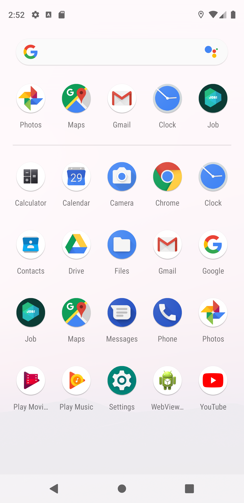
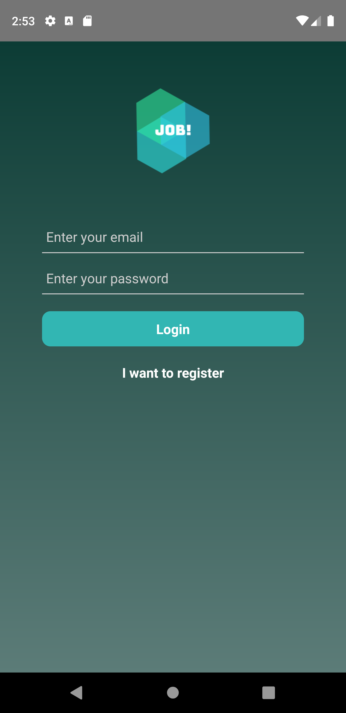
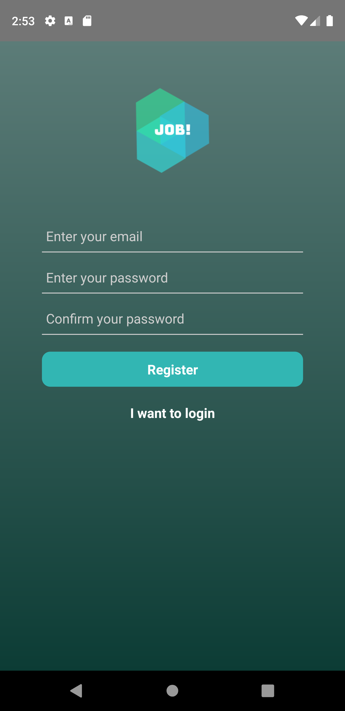
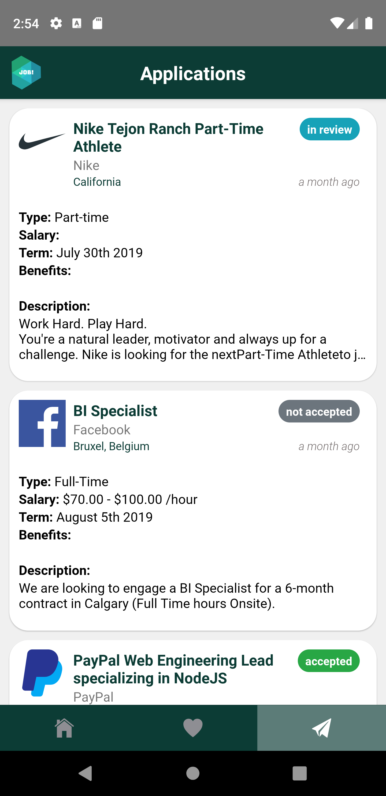
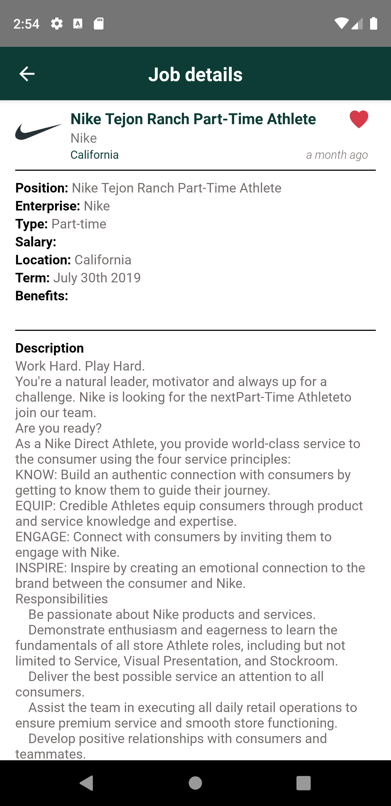

# job
**To try this app:**
* run `npm install` to install all dependencies
* run `./android/gradlew bundleRelease` to generate the APK
* launch an android emulator on Android Studio
* run `react-native run-android --variant=release` to install and launch the APK

Hooray! 🎉🎉

**Screenshots**
* IOS
  <table border="0px">
    <tr>
        <td>
            
        </td> 
        <td>
            
        </td>
        <td>
            
        </td>
    </tr>
    <tr>
        <td>
            
        </td>
        <td>
            
        </td>
        <td>
            
        </td>
    <tr>
     <tr>
        <td>
            
        </td>
        <td>
            
        </td>
        <td>
            
        </td>
    <tr>
    </table>

* Android
  <table>
    <tr>
        <td>
            
        </td>
        <td>
            
        </td>
        <td>
            
        </td>
    </tr>
    <tr>
        <td>
            
        </td>
        <td>
            
        </td>
        <td>
            
        </td>
    </tr>
    <tr>
        <td>
            
        </td>
        <td>
            
        </td>
        <td>
            
        </td>
    </tr>
    <tr>
        <td>
            
        </td>
        <td></td>
        <td></td>
    </tr>
  </table>
